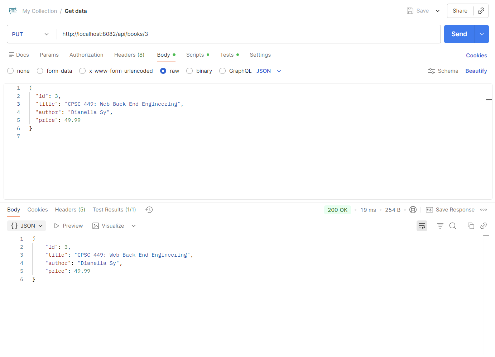
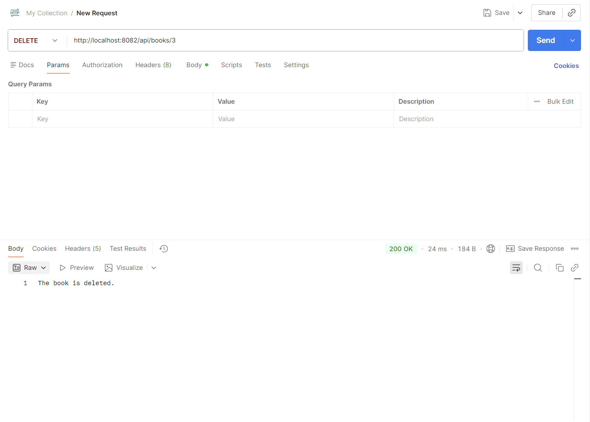
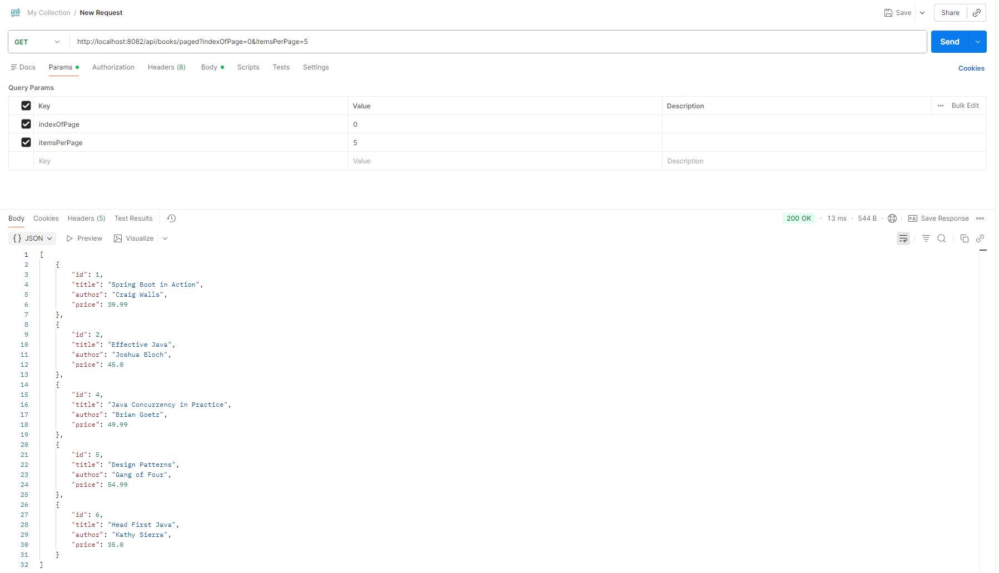
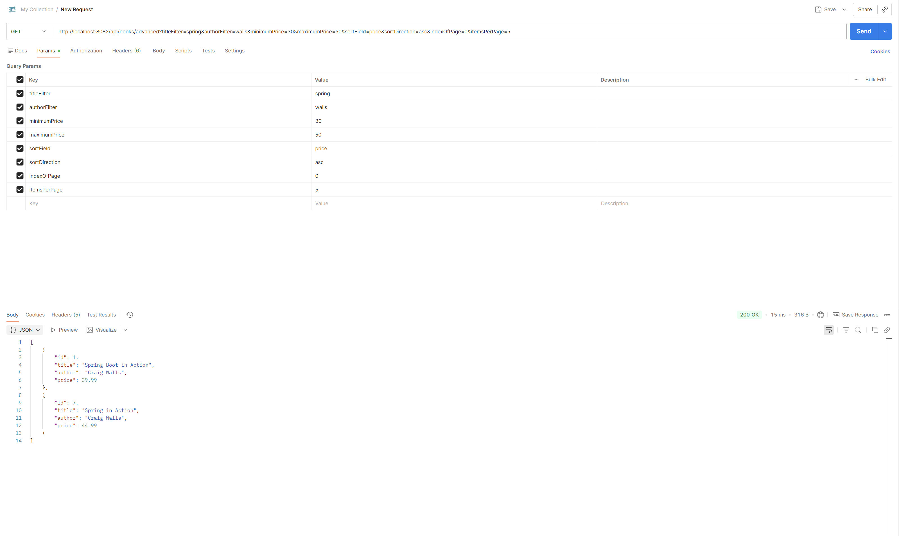

# Building On Books API: Advanced Endpoints & Features

## PUT Endpoint (Update Book)

## PATCH Endpoint (Partial Update)

## DELETE Endpoint (Remove Book)

## GET Endpoint with Pagination

## Advanced GET Endpoint with Filtering, Sorting, and Pagination Combined in the Valid Order 
