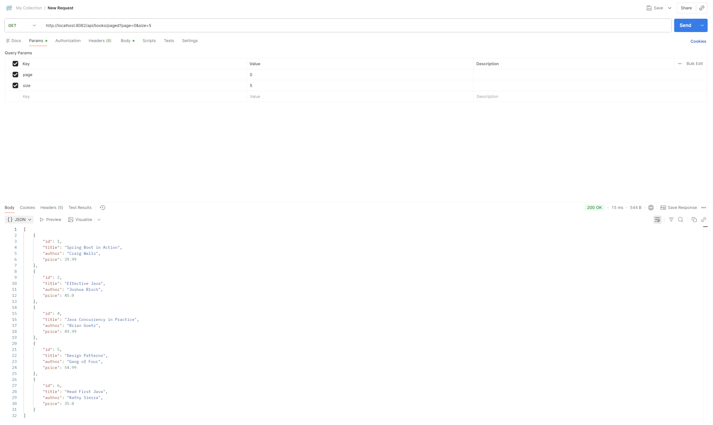

# Building On Books API: Advanced Endpoints & Features

## PUT endpoint (update book)

## PATCH endpoint (partial update)

## DELETE endpoint (remove book)

## GET endpoint with pagination

## Advanced GET endpoint with filtering, sorting, and pagination combined in the valid order
